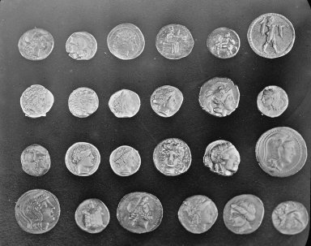
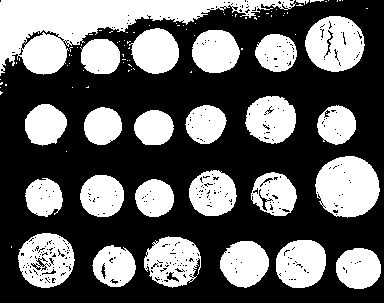
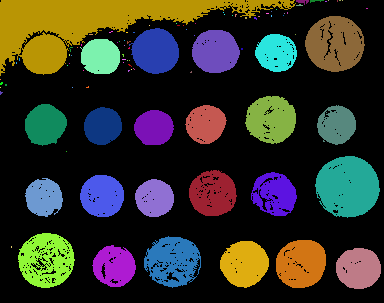
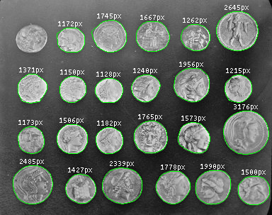

Quick start guide
=================

Here we illustrate the use of :mod:`jicbioimage` to segment an image of Greek
coins from Pompeii.

First we load the image from `scikit-image <http://scikit-image.org/>`_
as a numpy array.

.. code-block:: python

    >>> import skimage.data
    >>> array = skimage.data.coins()

We then create a :class:`jicbioimage.core.image.Image` instance from the array.

.. code-block:: python

    >>> from jicbioimage.core.image import Image
    >>> image = Image.from_array(array)

If using IPython qtconsole/notebook the image can be viewed directly in
the interpreter.

.. code-block:: python

    >>> image  # doctest: +SKIP

We can now threshold the image using a number of standard transformations.

.. code-block:: python

    >>> from jicbioimage.transform import equalize_adaptive_clahe, smooth_gaussian, threshold_otsu
    >>> image = equalize_adaptive_clahe(image)
    >>> image = smooth_gaussian(image)
    >>> image = threshold_otsu(image)
    >>> image  # doctest: +SKIP

Let us segment the thresholded image into connected components.

.. code-block:: python

    >>> from jicbioimage.segment import connected_components
    >>> segmentation = connected_components(image, background=0)
    >>> segmentation  # doctest: +SKIP

The :func:`jicbioimage.segment.connected_components` function returns an instance of
the :class:`jicbioimage.segment.SegmentedImage` class, which provides access to
segmented regions of interest as :class:`jicbioimage.segment.Region` instances.

Finally, let us write a couple of functions to create an augmented reality image.

.. code-block:: python

    >>> import numpy as np
    >>> from jicbioimage.illustrate import AnnotatedImage
    >>> def text_position(region):
    ...     "Return x, y coordinates of text position."
    ...     ys, xs = region.index_arrays
    ...     y = np.min(ys) - 5
    ...     x = np.mean(xs, dtype=int)
    ...     return (y, x) 
    ...
    >>> def augment_image(image, segmentation):
    ...     "Return an augmented image."
    ...     augmented = AnnotatedImage.from_grayscale(image)
    ...     for i in segmentation.identifiers:
    ...         region = segmentation.region_by_identifier(i)
    ...         if region.area > 300 and region.area < 5000:
    ...             augmented.mask_region(region.convex_hull.border)
    ...             pos = text_position(region.convex_hull)
    ...             text = "{}px".format(region.convex_hull.area)
    ...             augmented.text_at(text, pos, center=True, antialias=False)
    ...     return augmented
    ...
    >>> augmented = augment_image(array, segmentation)
    >>> augmented  # doctest: +SKIP

