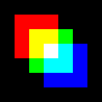

Working with images
===================

Introduction
------------

There are several types of images in the :mod:`jicbioimage.core.image` module.
Raw data is contained in the :class:`jicbioimage.core.image.Image` class. The
:class:`jicbioimage.core.image.ProxyImage` and
:class:`jicbioimage.core.image.MicroscopyImage` classes contain image meta data
along with a reference to the raw image.

The :class:`jicbioimage.core.image.Image` is a subclass of :class:`numpy.ndarray`.
In addition to the :class:`numpy.ndarray` functionality the
:class:`jicbioimage.core.image.Image` class has specialised functionality for
creating images, tracking the history of images and returning png/html
representations of images.

Creating images
---------------

Using :mod:`numpy` to create images
^^^^^^^^^^^^^^^^^^^^^^^^^^^^^^^^^^^

There are several ways of creating images. One can use the
functionality inherited from :class:`numpy.ndarray`.

.. code-block:: python

    >>> from jicbioimage.core.image import Image
    >>> Image((50,50))  # doctest: +SKIP
    Image([[  0,   0,   0, ..., 132,   0,   0],
           [ 90,  57,   0, ..., 101,  62,   0],
           [ 60, 100,  32, ...,   0, 100,  35],
           ...,
           [  0,   0, 208, ...,   0,   0,   0],
           [128,  68,  30, ...,   0, 128, 228],
           [ 34,   1,   1, ...,  69,  30,   2]], dtype=uint8)

.. warning:: When creating an image in this fashion it will be filled with
             the noise of whatever was present in that piece of computer memory
             before the memory was allocated to the image.

A safer way to create an image is to first create a :class:`numpy.ndarray`
using :func:`numpy.zeros` or :func:`numpy.ones` and then cast it to the
:class:`jicbioimage.core.image.Image` type.

.. code-block:: python

    >>> import numpy as np
    >>> np.zeros((50,50), dtype=np.uint8).view(Image)
    Image([[0, 0, 0, ..., 0, 0, 0],
           [0, 0, 0, ..., 0, 0, 0],
           [0, 0, 0, ..., 0, 0, 0],
           ..., 
           [0, 0, 0, ..., 0, 0, 0],
           [0, 0, 0, ..., 0, 0, 0],
           [0, 0, 0, ..., 0, 0, 0]], dtype=uint8)

When creating an array in this fashion it's history is empty.

.. code-block:: python

    >>> np.zeros((50,50), dtype=np.uint8).view(Image).history
    []

To assign a creation event to the image history one can use the
:meth:`jicbioimage.core.image.Image.from_array` class method.

.. code-block:: python

    >>> ar = np.zeros((50,50), dtype=np.uint8)
    >>> im = Image.from_array(ar)
    >>> im.history
    ['Created image from array']

Creating images from file
^^^^^^^^^^^^^^^^^^^^^^^^^

Suppose that we wanted to create an :class:`jicbioimage.core.image.Image` instance
from the file ``images/rgb_squares.png``.

.. code-block:: python

    >>> fpath = "images/rgb_squares.png"

..
    This is just to make the doctest pass.

    >>> import os.path
    >>> fpath = os.path.join("source", fpath)

This can be achieved using the :meth:`jicbioimage.core.image.Image.from_file` class
method.

.. code-block:: python

    >>> im = Image.from_file(fpath)  # doctest: +ELLIPSIS, +NORMALIZE_WHITESPACE

Accessing png representations of an image
-----------------------------------------

The :func:`jicbioimage.core.image.Image.png` function can be used to access
the image as a PNG binary string. This function is used internally to implement
the IPython integration, which allows images to be viewed directly in IPython
qtconsole/notebook.

.. code-block:: python

    >>> im  # doctest: +SKIP

